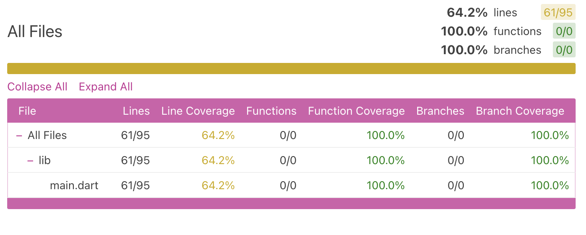

# flutter-dart-training

## general 
* run all flutter cms from within `./flutter_application_1`
* dart is type safe
* dynamic types are allowed
* pub.dev is the open source dart package manager
* following this course https://codelabs.developers.google.com/codelabs/flutter-codelab-first#1
* pubspec.yaml is the config for flutter apps and environments
* flutter run, press R in CLI for hot-reload (though I was hoping this was automatic?)
    * when running using vscode 'run + debug' option, hot-reload is actually hot (changes are applied once saved)

## building 
* `sudo softwareupdate --install-rosetta --agree-to-license` > needed to build to Android
* `flutter build apk` > produces .apk in ./build/

## unit tests
* `flutter test --coverage` > generate code coverage
* `npx lcov-viewer lcov flutter_application_1/coverage/lcov.info` > generate html coverage reports

